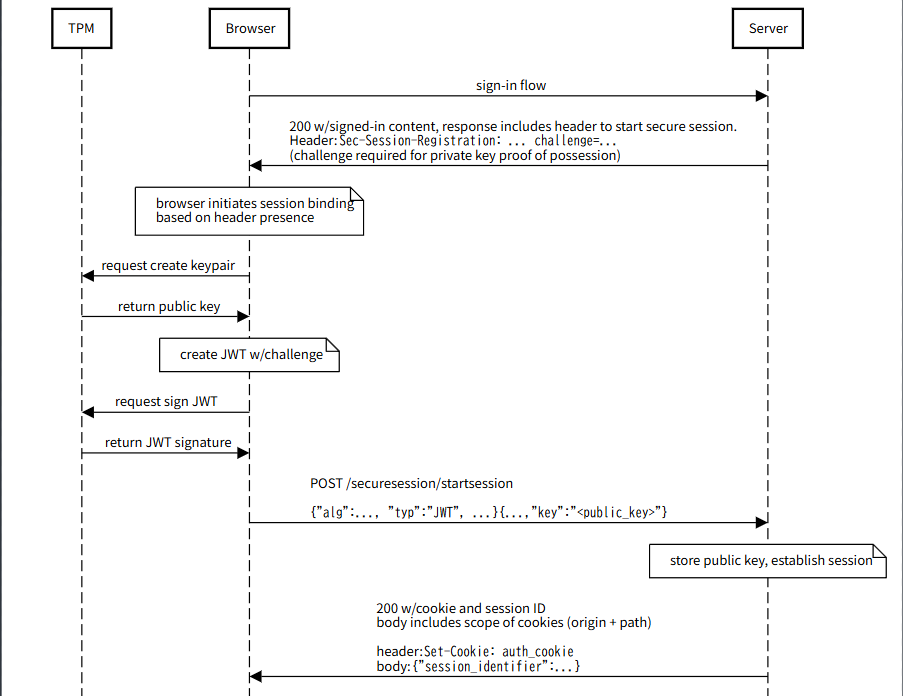
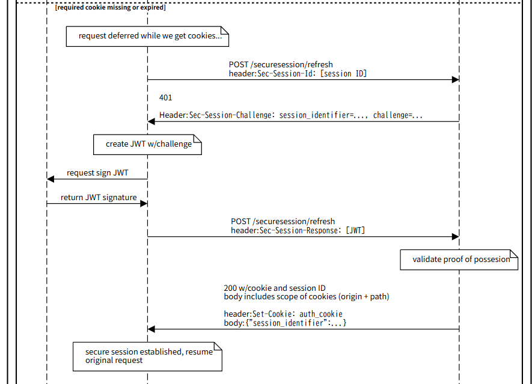

# Sample ID App with DBSC Integration

This application demonstrates a login system that uses Device-Bound Session Credentials (DBSC) for enhanced security.

## Features

- User authentication with username/password
- DBSC integration for device-bound sessions
- Cookie-based session management
- Cookie refresh mechanism

## Verification Environment
The application has been verified to work with the following settings:
- Chrome version: 135.0.7049.115
- [chrome://flags/#enable-standard-device-bound-session-credentials](chrome://flags/#enable-standard-device-bound-session-credentials) set to "Enable Without Origin Trial Token"
- [chrome://flags/#enable-standard-device-bound-sesssion-refresh-quota](chrome://flags/#enable-standard-device-bound-sesssion-refresh-quota) set to "Disabled"

Settings should look like this:


## Requirements

- Docker (for the database)
- Node.js (v20.11.1 or compatible with Next.js and Prisma)

## Setup and Run

1. Install dependencies:
   ```
   npm install
   ```

2. Set up the database (PostgreSQL):
   ```
   npm run db:migrate
   ```

3. Seed the database with a test user:
   ```
   npm run db:seed
   ```
   This creates a user with the following credentials:
   - Username: `testuser`
   - Password: `password`

4. Run the application:
   ```
   npm run dev
   ```

5. Open http://localhost:3000 in your browser

## How It Works

1. User logs in with username/password
2. After successful authentication, the DBSC flow is initiated
3. The initial auth cookie is set with the user's session identifier
4. When the cookie is refreshed, the same session identifier is maintained, but with a new cookie value
5. DBSC binds the session to the device's hardware-backed credentials

## DBSC Flow

The application follows this flow:
  
*Session initialization flow (from [Device Bound Session Credentials explainer](https://github.com/w3c/webappsec-dbsc/blob/main/reg_and_refresh.svg))*

When "Cookie Expired" message appears on the screen, clicking "Fetch Data" will trigger the refresh flow:
  
*Session refresh flow (from [Device Bound Session Credentials explainer](https://github.com/w3c/webappsec-dbsc/blob/main/reg_and_refresh.svg))*

## API Routes

- `/api/login` - Handles user authentication
- `/api/start-dbsc-flow` - Initiates the DBSC flow
- `/api/register-dbsc-cookie` - Registers the DBSC token
- `/api/refresh-dbsc-cookie` - Refreshes the DBSC token

## Database Models

- `User` - Stores user authentication information
- `DbscSession` - Stores DBSC session information and public keys
- `Challenge` - Stores challenge tokens for DBSC verification

## Technology Stack

- Next.js
- React
- Prisma ORM
- PostgreSQL
- Tailwind CSS

## References
For more information about DBSC endpoints, see [this blog post](https://zenn.dev/maronn/articles/program-dbsc-app) (in Japanese).
