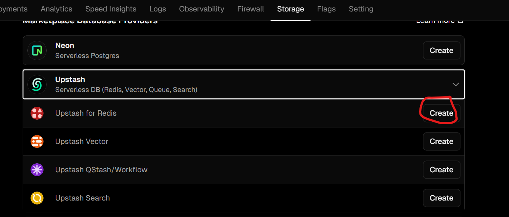
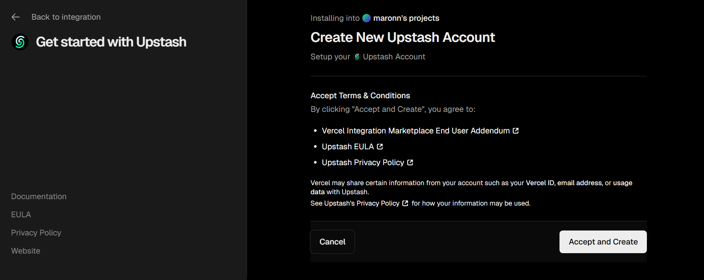
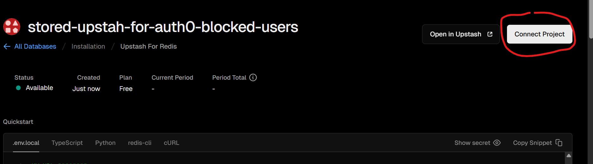
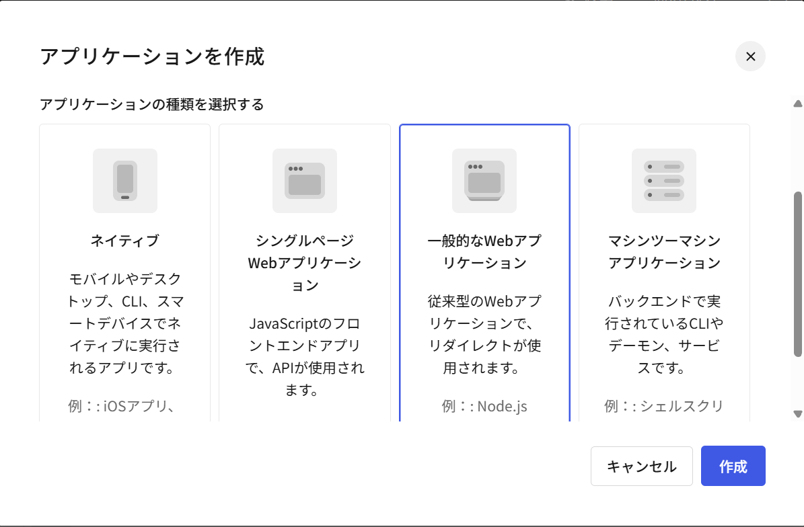
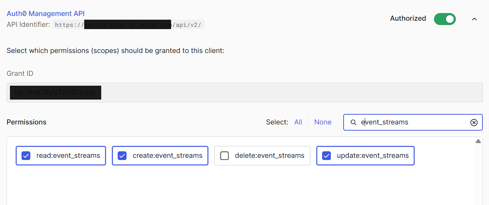
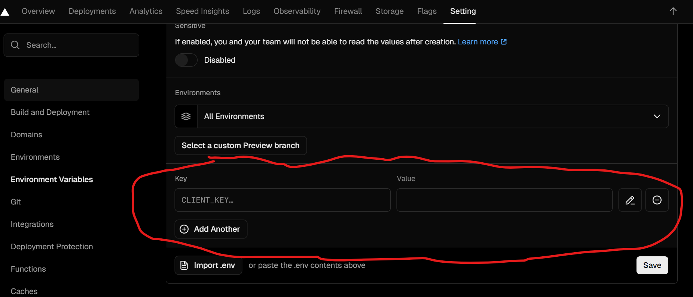

## このブランチについて
このブランチは、以下記事のサンプルアプリケーションです。  
ここでは、サンプルアプリケーションを実際に動かすための手順を記載します。  

## 前提
各種プロジェクトの設定を行い、実際に動作確認するための説明をしますが、以下のことが完了している前提になっています。  
- Auth0のテナントが作成されていること  
- Vercelアカウントが作成されていて、Vercel CLIがインストールされていること  
- Cloudflareアカウントが作成されていて、Wrangler CLIがインストールされていること  
上記については割愛しますので、各自で準備をお願いします。  

## client-and-resource-serverのデプロイ
client-and-resource-serverディレクトリで`pnpm run login:vercel`コマンドを実行してVercelにログインします。  
`pnpm run deploy:vercel`コマンドを実行してNext.jsアプリケーションをデプロイします。  
デプロイが完了すると、vercelのダッシュボード上にclient-and-resource-serverというプロジェクトが作成されます。  
プロジェクトの中に入り、[https://your-next-app.vercel.app](https://your-next-app.vercel.app)のようなURLが表示されます。  
このURLの末尾に`/api`を不要した値をclient-and-resource-serverディレクトリの.env.sampleのAUTH0_AUDIENCEに設定します。  
また、notify-user-blockディレクトリの.env.sampleのNOTIFY_URLsに`vercelのURL/api/user-block`のように設定します。  

## upstream-redisの準備
VercelプロジェクトのStorageタブを開き、Upstash→Upstash for RedisのCreateボタンをクリックします。  
  
確認画面がでるので、「Accept and Create」をクリックします。  
  
以降は任意のリージョンやプラン、データベースを選択します。  
作成ができたら、表示される画面のConnect Projectボタンをクリックします。  
  
client-and-resource-serverプロジェクトを選び、連携するとUpstash Redisの環境変数がVercelのclient-and-resource-serverプロジェクトに自動的に追加されます。  
SettingsタブのEnvironment Variablesで追加されていることを確認ができます。  

## Auth0の設定手順
### アプリケーションの作成
Auth0では以下2種類のアプリケーションを作成します。  
- アプリ①：ユーザー認証用のRegular Web Application(Next.jsアプリケーション用)
- アプリ②：スクリプト実行用のバックエンドアプリケーション(Machine to Machine Application)

まず、アプリ①のRegular Web Applicationを作成します。  
Auth0 Dashboardにアクセスして、Applications → Applicationsを開き、画面右上にあるアプリケーション作成ボタンをクリックします。  
Nameには任意の名前（例えばsample-id-app）を入力し、Application TypeはRegular Web Applicationsを選択してCreateをクリックします。  
  
作成後、Settingsタブで以下の情報をclient-and-resource-serverディレクトリの.env.sampleで以下ののように設定します。
- Domain→ AUTH0_DOMAINに設定
- Client ID→ AUTH0_IDに設定
- Client Secret→ AUTH0_SECRETに設定

アプリ②も同様に作成し、Client IDとClient Secretをnotify-user-blockディレクトリの.env.sampleで以下のように設定します。  
- Domain→ AUTH0_TENANT_DOMAINに設定
- Client ID→ AUTH0_MANAGEMENT_CLIENT_IDに設定
- Client Secret→ AUTH0_MANAGEMENT_CLIENT_SECRETに設定

### APIの作成・設定
次に、アプリ①のRegular Web Applicationに紐づけるAPIを作成します。  
これの紐づけを行うことで、payloadが付与されたアクセストークンを取得することができます。  
Applications → APIsを開き、Create APIをクリックします。  
Nameには任意の名前（例：Sample ID App API）を入力し、Identifierにはclient-and-resource-serverディレクトリの.env.sampleで設定したAUTH0_AUDIENCEの値を入力します。  
後はデフォルトのまま、Createをクリックします。  
このAPIはアプリ①のAPIsタブで以下のようにAuthorizedにします。  
  
アプリ②については、APIsでAuth0 Management APIをAuthorizedにします。  
Auth0 Management APIのPermissionsでは、read:event_streams、create:event_streams、update:event_streamsをチェックしてAuthorizeをクリックします。  
  

## Cloudflare Workerのデプロイ

まず、Wrangler CLIでCloudflareにログインします。  
`npx wrangler login`コマンドを実行すると、ブラウザが開き、Cloudflareへのログインが求められます。  
notify-user-blockディレクトリの.env.sampleを.envにリネームします。  
Worker URLを取得するために初回デプロイを行います。  
`pnpm run deploy`コマンドを実行すると、デプロイが完了して、[https://notify-user-block.your-subdomain.workers.dev](https://notify-user-block.your-subdomain.workers.dev)のようなURLが表示されます。  
このURLをclient-and-resource-serverディレクトリの.env.exampleのUSER_BLOCK_APP_URLに設定します。  
また、notify-user-blockディレクトリの.envのAUTH0_EVENT_STREAM_WEBHOOK_ENDPOINTに`/webhook`パスを付与したうえで設定します。  
そして、notify-user-blockディレクトリの.env.sampleを.envにします。  
環境変数をCloudflare Workerに設定するので、notify-user-blockディレクトリで`pnpm run set:secrets`コマンドを実行します。  
デプロイしたCloudflare Workerの設定タブで、APP_URL, JWT_PRIVATE_KEY, NOTIFY_URLSシークレットが設定されていることを確認します。  

## vercelの環境変数設定
client-and-resource-serverディレクトリの.env.exampleの内容を、Vercelのclient-and-resource-serverプロジェクトのSettingsタブのEnvironment Variablesで環境変数を設定します。  
画像赤枠で追加するか、import .envで.env.exampleをアップロードして設定します。  
  

## Event Streamの作成
notify-user-blockディレクトリに移動して、`pnpm run handle:event-stream`コマンドを実行し、Auth0のEvent Streamを作成します。  
作成後は、Auth0 Dashboard → Event Streamsを開き、Event Streamsが作成されていることを確認します。  
また、デプロイしたCloudflare Workerの設定タブで、AUTHORIZATION_SECRETSシークレットが設定されていることを確認します。  