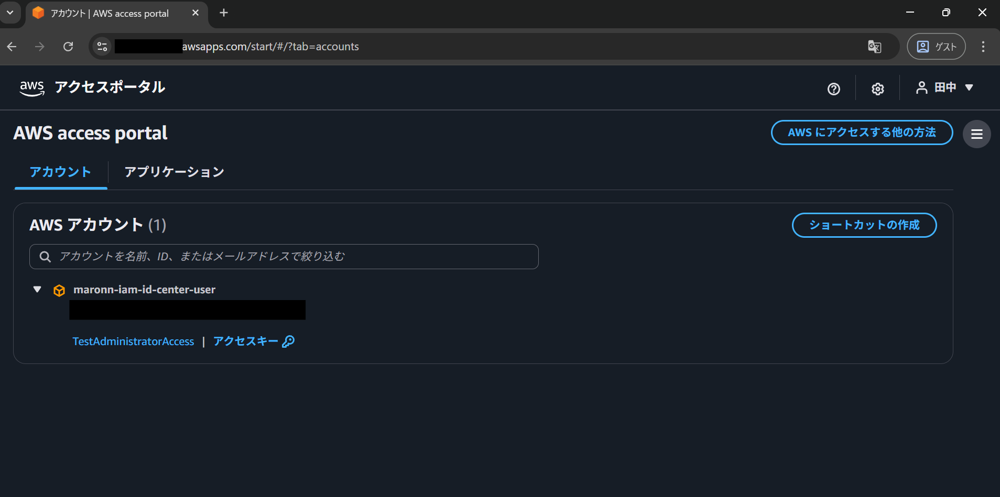
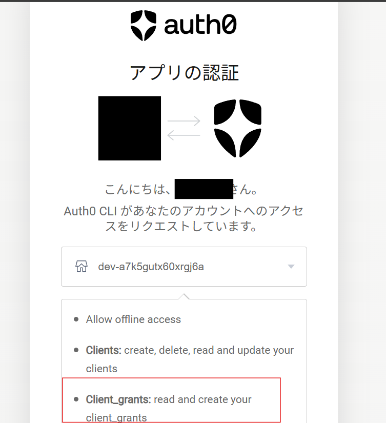

## セットアップ手順
### 前提条件
以下の準備はできていることを前提としています  
- AWSアカウント
- AWS IAM Identity Center (AWS SSO)でSSO用のユーザーと権限の設定
    - 以下のような画面が存在してればOKのはずです。
    
- Auth0アカウント
- Cloudflareアカウント

また、AWSのSSOのプロファイルをターミナルで記入する必要がありますが、その内容についてはここでは触れません。  

### 事前準備
#### miseのインストール

[ドキュメント](https://mise.jdx.dev/getting-started.html#installing-mise-cli)を参考にしてmiseをインストールしてください。

#### シェル統合の設定

miseを自動的に有効化するため、シェル設定ファイルに以下を追加：

```bash
# ~/.bashrc または ~/.bash_profile の場合
echo 'eval "$(mise activate bash)"' >> ~/.bashrc

# ~/.zshrc の場合
echo 'eval "$(mise activate zsh)"' >> ~/.zshrc

# fishの場合
echo 'mise activate fish | source' >> ~/.config/fish/config.fish
```

設定後、シェルを再起動またはリロード：

```bash
# bashの場合
source ~/.bashrc

# zshの場合
source ~/.zshrc
```

### プロジェクトのセットアップ
以下のタスクを実行して、必要なツールをインストールし、Auth0およびAWSのProviderをセットアップします。  
```bash
mise run setup
```  
auth0のログイン、AWS SSOのログインが完了したらauth0とawsディレクトリ配下にあるterraform.tfvarsを確認してください。  
aws_profile,aws_account_id,auth0_domain,auth0_client_id,auth0_client_secretが正しく設定されていればセットアップ完了です。  

#### auth0 CLIの認証方法について
auth0コマンドでログインするときに、「How would you like to authenticate?」と聞かれる場合があります。    
その場合は「As a user」を選択したら、問題なく動作しました。（もう片方の方でも動くかもしれませんが、試してはいないです）
#### Auth0テナントの選択
auth0 loginコマンドを実行すると、ログイン後に認証するテナントを選択する画面が表示されます。  
  
Event Streamを設定するテナントを選択してください。  
なお、権限についてClient_grantsの権限が許可する権限に含まれているか確認してください。（画像赤枠）  
それがないとTerraform用のAuth0アプリの設定が完了できないので、必ず確認した上で権限の許可をしてください。  

### セットアップ後の手順
#### 1. Auth0でEvent Streamの設定
以下のコマンドでauth0ディレクトリの移動し、Event Streamを設定します：  

```bash
cd auth0
terraform init
terraform apply
```
対象のAuth0テナントのサイドメニューにあるEvent Streamsに移動し、Event Streamが作成されていることを確認してください。

#### 2. Cloudflare Workersのデプロイ
resource-appディレクトリに移動し、setup-deploy.shを実行します。  
実行後以下の設定が完了します。    
- Cloudflare D1データベースの作成
- ログイン用のAuth0アプリケーションの作成
- Cloudflare Workersへのデプロイ

#### 3. AWS EventBridgeでAuth0イベントソースとの紐づけ
以下のコマンドでawsディレクトリに移動し、EventBridgeとAuth0イベントソースの紐づけを行います：  

```bash
cd ../aws
bash update-eventbus.sh
```
AWSのマネジメントコンソールのEventBridgeにアクセスし、バス→イベントバスでカスタムイベントにAuth0からのイベントソースが紐づけられていることを確認してください。

#### 4. awsのTerraformリソースの適用
awsディレクトリ内で、`terraform init`と`terraform apply`を実行しAWSの残りのリソースを作成します。

## 参考リンク

- [mise公式サイト](https://mise.jdx.dev/)
- [mise GitHub](https://github.com/jdx/mise)
- [AWS IAM Identity Center (AWS SSO)](https://docs.aws.amazon.com/singlesignon/latest/userguide/what-is.html)
- [Terraform公式サイト](https://www.terraform.io/)
