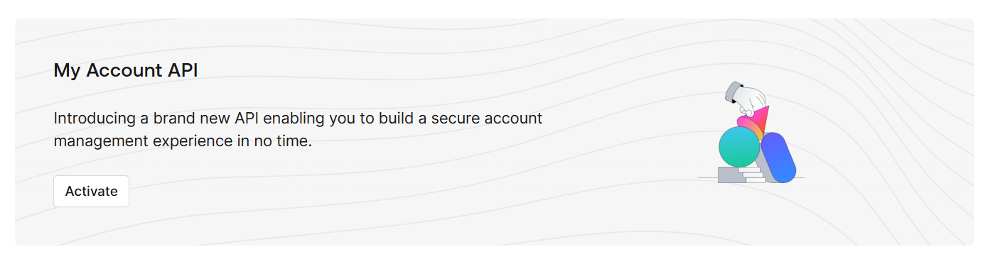

## セットアップ手順

### 前提条件

以下が事前に準備されている必要があります。

- Auth0 テナントが作成済みであること
- [Auth0 CLI](https://auth0.com/docs/deploy-monitor/auth0-cli) がインストール済みであること
- Cloudflare アカウントが作成済みであること
- [wrangler コマンド](https://developers.cloudflare.com/workers/wrangler/install-and-update/) がインストール済みで、`wrangler login` でログイン済みであること
- [Terraform](https://developer.hashicorp.com/terraform/install) または [OpenTofu](https://opentofu.org/docs/intro/install/) がインストール済みであること
- `jq` がインストール済みであること
- `pnpm` がインストール済みであること

### 1. My Account API の有効化

Auth0 ダッシュボードで **Applications > APIs** を開き、「Auth0 My Account API」を Activate します。



この操作はダッシュボードからのみ実行可能です。セットアップスクリプトを実行する前に、必ずこの手順を完了させてください。

### 2. Google Cloud Console で OAuth クライアントを作成

以下のサイトで「Google Auth Platform」までを行い、GoogleのOAuthクライアントを作成してください。
https://marketplace.auth0.com/integrations/google-social-connection
作成後、`Client ID`と`Client Secret`は控えておいてください。

> **注意**: Auth0 ダッシュボードでの Google connection の設定（Client ID / Secret の入力、Purpose の変更、アプリへの紐づけ）はセットアップスクリプトが Terraform で自動的に行います。手動での設定は不要です。

### 3. セットアップスクリプトの実行

以下のコマンドを実行します。

```bash
cd connected-account
./setup.sh
```

スクリプトは以下の処理を自動で行います。

1. **前提条件のチェック** — `jq`、`pnpm`、`wrangler`、`auth0`、`terraform`（または `tofu`）がインストールされているか確認します。
2. **Auth0 CLI へのログイン** — 必要なスコープでログインします。複数テナントがある場合は、使用するテナントを選択します。
3. **Terraform provider 用 M2M アプリの作成** — Terraform が Auth0 リソースを管理するための Machine-to-Machine アプリケーションを作成し、Management API への Client Grant を付与します。
4. **対話形式での入力収集** — テストユーザーのパスワードと、手順 2 で控えた Google OAuth2 の Client ID / Client Secret の入力を求めます。
5. **Terraform apply（1回目）** — Auth0 上に Regular Web Application（`connected-account-token-vault`）、テストユーザー（`test@example.com`）、Google connection（Connected Accounts 有効）、Token Vault 用の Client Grant を作成します。
6. **`.dev.vars` の生成** — ローカル開発用の環境変数ファイルを `connected-account/.dev.vars` に生成します。
7. **Cloudflare Workers へのデプロイ** — 依存関係をインストールし、Cloudflare Workers にデプロイします。
8. **Cloudflare Workers シークレットの設定** — Auth0 の認証情報とコールバック URL を Cloudflare Secrets に設定します。
9. **Terraform apply（2回目）** — デプロイ先の Workers URL を Auth0 アプリのコールバック URL に追加します。

### 4. 動作確認

セットアップ完了後、以下のコマンドでローカル開発サーバーを起動できます。

```bash
cd connected-account && pnpm dev
```

ブラウザで `http://localhost:5173` にアクセスして動作を確認してください。
もしくはCloudflare Workersでデプロイしたアプリで動作を確認してください。
