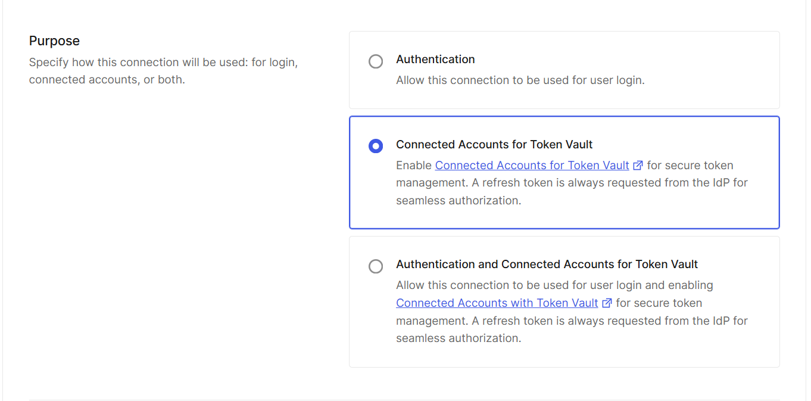

## セットアップ手順

### 前提条件

以下が事前に準備されている必要があります。

- Auth0 テナントが作成済みであること
- [Auth0 CLI](https://auth0.com/docs/deploy-monitor/auth0-cli) がインストール済みであること
- Cloudflare アカウントが作成済みであること
- [wrangler コマンド](https://developers.cloudflare.com/workers/wrangler/install-and-update/) がインストール済みで、`wrangler login` でログイン済みであること
- `jq` がインストール済みであること
- `pnpm` がインストール済みであること

### 1. My Account API の有効化

Auth0 ダッシュボードで **Applications > APIs** を開き、「Auth0 My Account API」を Activate します。


この操作はダッシュボードからのみ実行可能です。セットアップスクリプトを実行する前に、必ずこの手順を完了させてください。

### 2. Google connection の設定

Auth0 ダッシュボードで Google connection を設定します。

#### 2-1. Google Cloud Console で OAuth クライアントを作成
以下のサイトを元にGoogle OAuthクライアントを作成してください。
1. [Google Cloud Console](https://console.cloud.google.com/) を開く
2. **APIs & Services > Credentials** を開く
3. **+ CREATE CREDENTIALS > OAuth client ID** をクリック
4. Application type: **Web application** を選択
5. Authorized redirect URIs に `https://<your-auth0-domain>/login/callback` を追加
6. 作成後、**Client ID** と **Client Secret** を控えておく

#### 2-2. Auth0 ダッシュボードで Google connection を設定

1. Auth0 ダッシュボードで **Authentication > Social** を開く
2. `Google / Gmail` をクリック（存在しない場合は `+ Create Connection` から追加）
3. Google Cloud Console で取得した **Client ID** と **Client Secret** を入力する
4. `Purpose` を `Connected Accounts for Token Vault` に変更する

5. Save をクリック

> **注意**: Purpose の変更は必須です。`Standard Authentication` のままでは連携時に `The specified connection does not support connected accounts or is not active` エラーが発生します。

> アプリへの紐づけ（Applications タブでの有効化）はセットアップスクリプトが自動で行うため、ダッシュボードでの操作は不要です。

### 3. セットアップスクリプトの実行

以下のコマンドを実行します。

```bash
cd connected-account
./setup.sh
```

スクリプトは以下の処理を自動で行います。

1. **Auth0 CLI へのログイン** — 必要なスコープでログインします。複数テナントがある場合は、使用するテナントを選択します。
2. **Auth0 アプリケーションの作成** — `connected-account-token-vault` という名前の Regular Web Application を作成します。コールバック URL にはローカル開発用の `http://localhost:5173` が設定されます。
3. **テストユーザーの作成** — `test@example.com` のテストユーザーを作成します（既に存在する場合はスキップ）。パスワードはスクリプト実行中に対話形式で入力します。
4. **My Account API (Token Vault) の設定** — アプリケーションに対して `create/read/delete:me:connected_accounts` スコープの Client Grant を付与し、Token Vault 用の grant_type を追加します。
5. **Google connection の設定確認** — ダッシュボードでの手動設定完了を確認するプロンプトが表示されます（手順 2 が完了していれば Enter を押して続行）。
6. **`.dev.vars` の生成** — ローカル開発用の環境変数ファイルを `connected-account/.dev.vars` に生成します。
7. **Cloudflare Workers へのデプロイ** — 依存関係をインストールし、Cloudflare Workers にデプロイします。
8. **Cloudflare Workers シークレットの設定** — Auth0 の認証情報と Workers の URL を Cloudflare Secrets に設定します。
9. **Auth0 アプリのコールバック URL の更新** — デプロイ先の Workers URL をコールバック URL に追加します。

### 4. 動作確認

セットアップ完了後、以下のコマンドでローカル開発サーバーを起動できます。

```bash
cd connected-account && pnpm dev
```

ブラウザで `http://localhost:5173` にアクセスして動作を確認してください。
もしくはCloudflare Workersでデプロイしたアプリで動作を確認してください。
