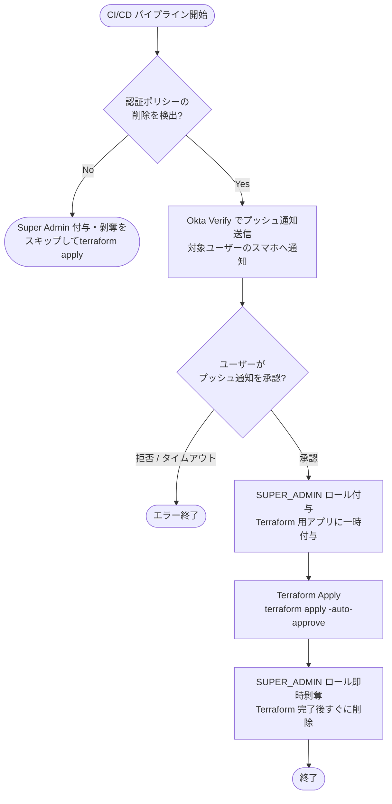

- この実装の目的
    - OktaのAPI Serviceからリソースを操作する時にSuper Adminを管理ロールに付与する必要があった
    - しかしSuper Adminは漏洩時の被害が大きくなる可能性があるので付与は不安。
    - であれば、Super AdminはSuper Admin権限を持つユーザーが許可して初めて設定できるようにすれば、Super Adminを常時付与せずに済む。
    - そこでこのプロジェクトでは、特定のterraformによるリソース操作の前にSuper Adminユーザーによる認証を求めるようにし、Super Adminを一時付与できる実装を行った。

- Super Adminにすることによるリスク
    - 現状のスコープ(ネットワークゾーンと認証ポリシーの作成・編集のみ可能)の場合、Super AdminとOrg Adminで認証ポリシー削除以外の差異が発生する事象は確認できなかった。
    - ケースとしては対象のAPI ServiceにSuper Adminを付与し、以下を試した。
        - Super AdminをAPI Serviceに昇格することで、任意のユーザーを管理者に昇格できるか？
            - 不可。`okta.roles.manage`がないため、権限エラーとなる。
        - 

- フローについて
フローは以下の通り。

上記の流れをCI上でできるように実装している。

- 実装の内容
